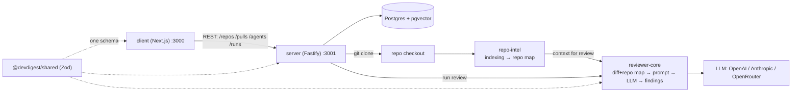

# Pipeline architecture

The single source of truth for how DevDigest's 4 packages talk to each other.
Module-level `CLAUDE.md` files link here instead of duplicating this text.

## Why this isn't a monorepo

`client`, `server`, `reviewer-core`, `e2e` are four independent packages, each
with its own `package.json` and lockfile; there are no workspaces. Shared code
(`@devdigest/shared`, `@devdigest/ui`) isn't published as an npm package — it's
**vendored** (copied) into `server/src/vendor/*` and `client/src/vendor/*`.
Linking happens through tsconfig path aliases, not workspace dependencies. A
change in one copy doesn't propagate to the other automatically.

## Review flow

1. `client` sends REST requests to `server` via TanStack Query hooks
   (`src/lib/hooks/*` → `src/lib/api.ts`).
2. Add a repo → `server` clones it to disk (`DEVDIGEST_CLONE_DIR`) and runs
   `repo-intel` (a module inside `server`, not a separate package) — it
   indexes symbols/import graph and builds the "repo map" (the **Indexed**
   badge).
3. Import a PR from GitHub (diff, commits, body, linked issues).
4. Hit **Review** → `server` calls `reviewer-core` (raw TS source via a
   tsconfig path alias, not a built package) → it assembles a prompt from the
   diff + agent system prompt + repo map → calls the LLM through an injected
   `LLMProvider`.
5. Every finding passes through the **grounding gate** (`groundFindings`) —
   findings that don't cite a real line in the diff are dropped; the score is
   recomputed deterministically, not taken from the LLM.
6. `server` persists the result in Postgres and streams progress via SSE
   (`fastify-sse-v2`) back to `client`.

`@devdigest/shared` (Zod contracts) is the single source of truth for all
three packages: one schema validates the request on the backend, serializes
the response, and provides types on the frontend.

## Infrastructure and cross-cutting gotchas

- Postgres 16 + pgvector — a single Docker container; the API and web app run
  on the host (`./scripts/dev.sh`).
- **Never run `docker compose down -v`** — it deletes the `devdigest_pgdata`
  volume along with every real imported repo and review, not just test data.
- Each package's detailed gotchas live in its own `CLAUDE.md`
  (`server/CLAUDE.md`, `client/CLAUDE.md`, `reviewer-core/CLAUDE.md`,
  `e2e/CLAUDE.md`) and aren't duplicated here.
